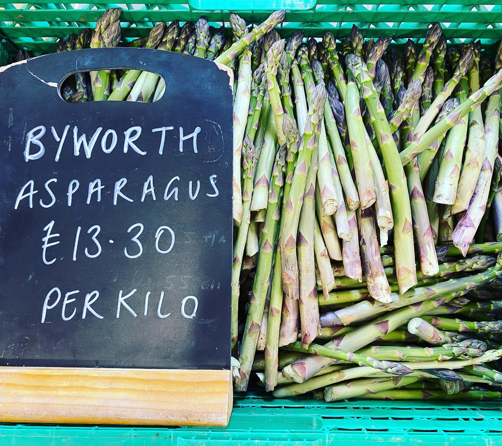
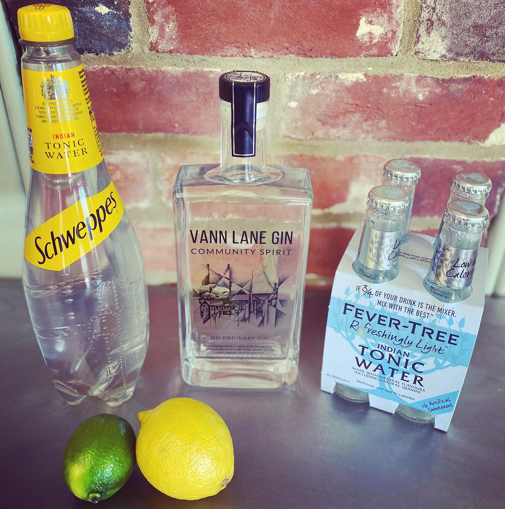
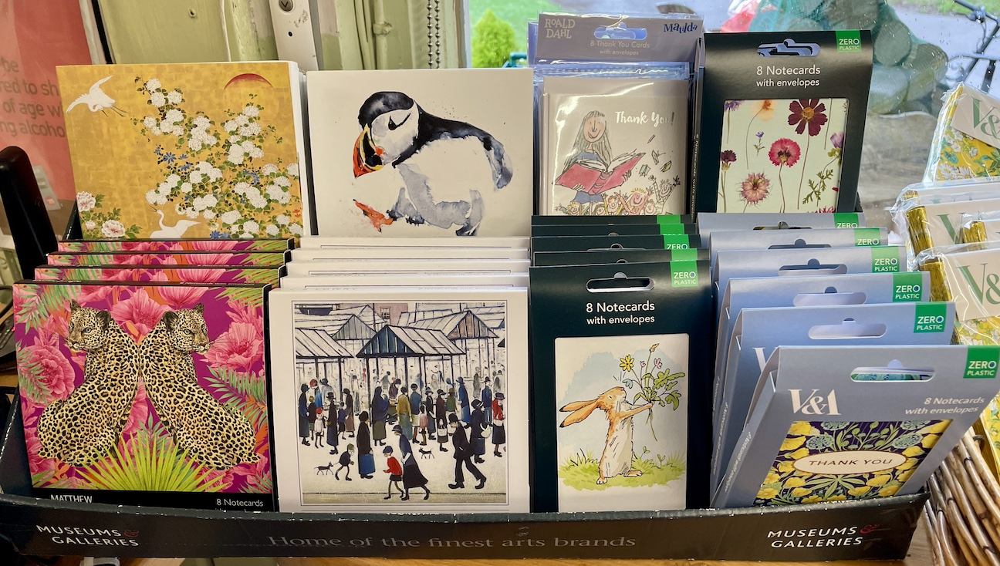
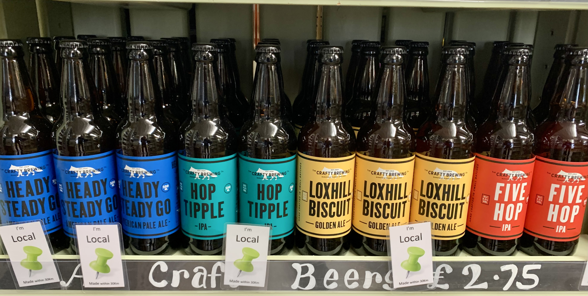
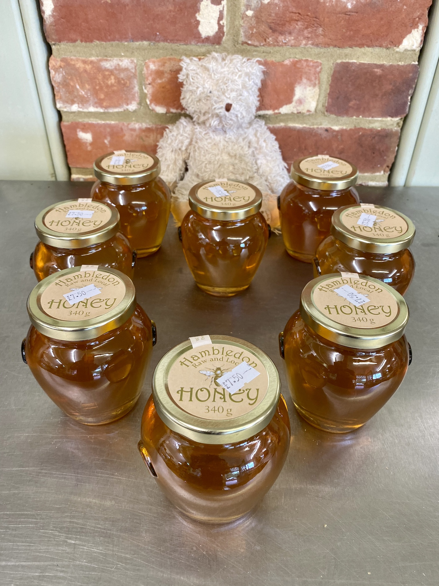
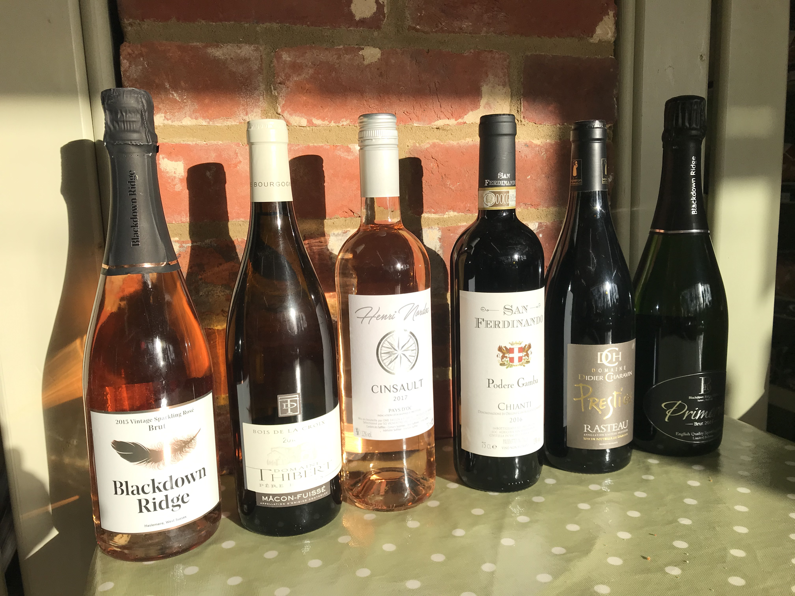
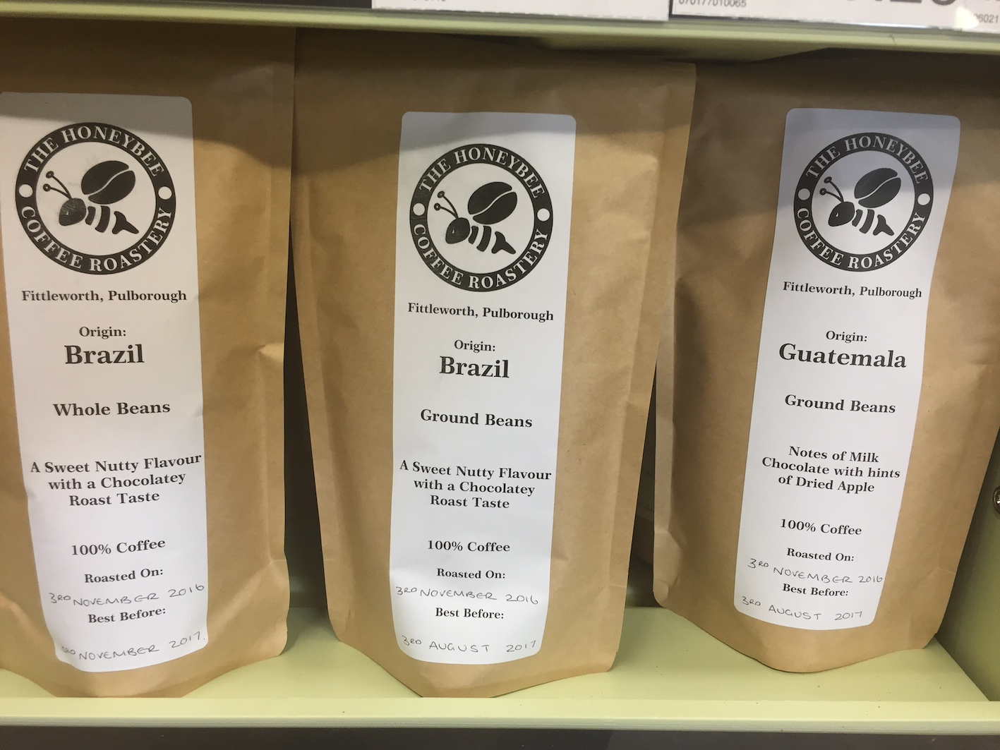
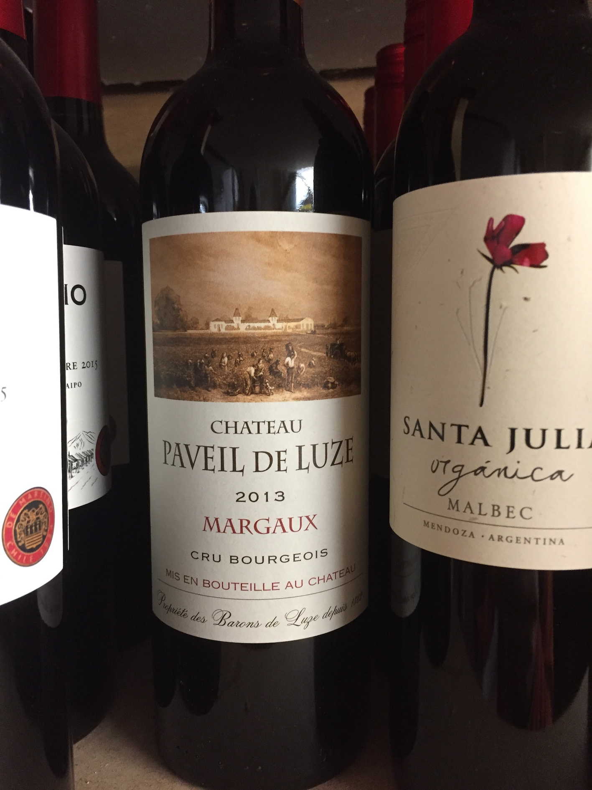
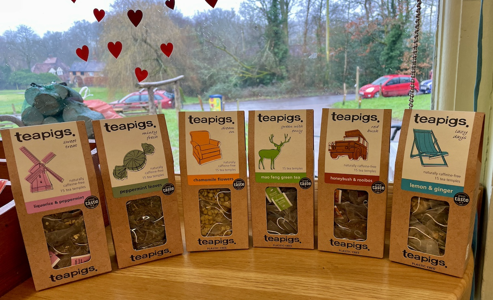

<section id="shop" class="hero-section center-content">
        <h2 class="red-text">The Shop</h2>

        

          <section
            class="center-section left-aligned-text"
            aria-label="About the shop"
          >
            

              <strong>The Shop is open Monday to Sunday 08:30–14:00</strong>
            

            

              <strong
                >The Shop has everything you'd expect from a village shop and
                more:</strong
              >
            

            

              Groceries – fresh fruit and veg, fantastic meat from our local
              butcher Youngs in Chiddingfold, fresh bread from the Södt bakery
              in Petworth, frozen meals and a large range of dry goods.
            

            

              Alcohol – local craft beers from Crafty Brewery in Dunsfold, gin
              from the distillery in the village (The Village Spirit
              Collective) and a selected range of wines.
            

            
Greetings cards and gifts.

            

              Local produce (when in season) including soft fruit from Tuesley
              Farm, Isle of Wight tomatoes, asparagus.
            

            
A wide range of newspapers and magazines.

            
A dry cleaning service.

            
And lots more…

          </section>
        

      </section>

      <section id="shop-gallery" class="gallery-section hero-section">
        

          

            
          

          

            
          

          

            
          

          

            
          

          

            
          

          

            
          

          

            
          

          

            
          

          

            
          

          

            
          

          

            
          

          

            
          

          

            
          

          

            
          

          

            
          

          

            
          

          

            
          

          

            
          

          

            
          

          

            
          

        

      </section>
      

